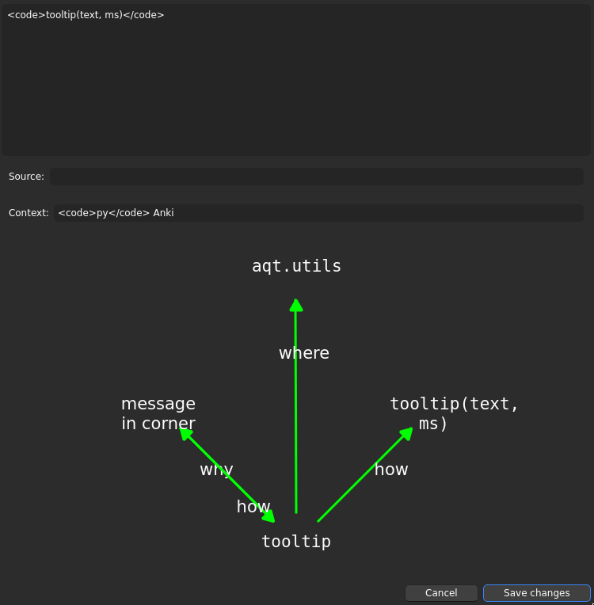
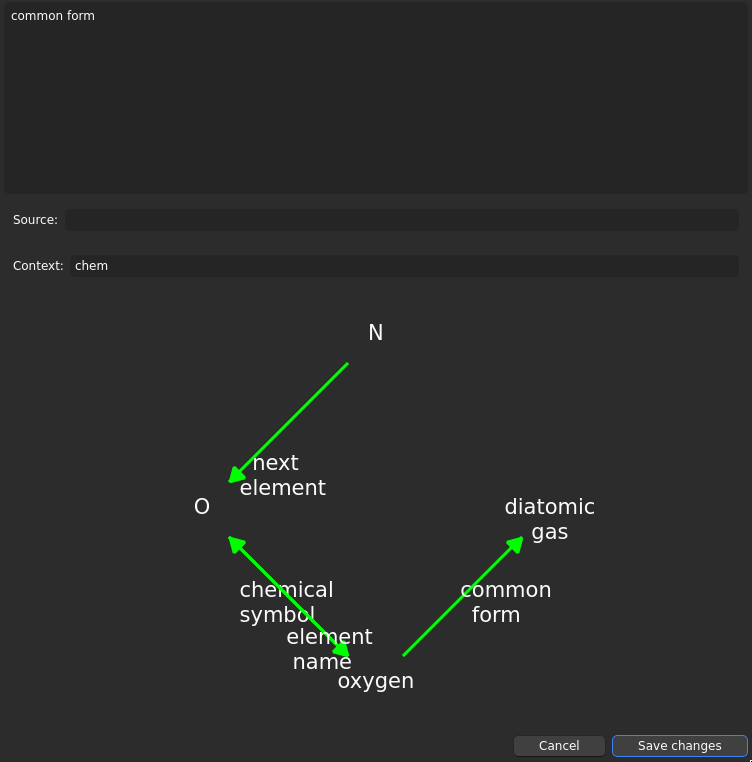

# Yukogurafu

"Yukogurafu" comes from "directed graph" and [Anki's tradition of using Japanese words]( https://en.wiktionary.org/wiki/%E6%9A%97%E8%A8%98#Japanese ), and is the name for an Anki add-on that lets you build notes as directed graphs.

## Theory
Consider the [Anki Manual's example card]( https://docs.ankiweb.net/getting-started.html#key-concepts ):
> Q: Chemical symbol for oxygen?
>
> A: O

It would also make sense to ask the reverse question.
You can set the note type to "Basic (and reversed card)", and get this card:
> Q: O
>
> A: Chemical symbol for oxygen?

But if you word it like that, the front of the card is confusing.
What does "O" mean here?
What is it asking for?
> Q: O - element name?
>
> A: oxygen - chemical symbol?

This reverses cleanly.
It's better, but then you have to memorise the question "chemical symbol?" on the back, or remember that it's not really part of the answer.

Ideally, the front of a card shows all of the question, and the back shows only the answer.
> Q: Element name for O?
>
> A: oxygen

But in vanilla Anki, that has to be a separate note.
You must repeat yourself.
We can do better.

The card associates "oxygen" to "O" via the relation "chemical symbol".
Another card could just as well associate "N" to "O" via "next element", or "oxygen" to "diatomic gas" via "common form", or "O" to "oxygen" via "element name".
In each case, one concept and a relation make the front of a card, while another concept makes the back of the card.

Concepts/terms/phrases : relations :: nodes : edges.
Each card can correspond to an edge in a graph.
The front shows a term (node) and how it relates (edge) to something else (node).
The back, to be recalled, shows that something else.

On any concept, there are many facts to relate it to other concepts.
To keep structure explicit, and not repeat yourself, you can combine these facts into larger graphs.
A term used in many questions and answers becomes a node with many edges to and from other nodes.

## Setup
Install it from AnkiWeb, when I post it there.
Until then, download the ZIP and install it manually with Anki's menu.
If needed, restart Anki.
If it still doesn't work, [raise an issue here]( https://github.com/0edk/yukogurafu/issues ) with the error message and/or faulty behaviour.

## Usage
Most features of Yukogurafu are concentrated in "Edit graph note", in the Tools menu at the top.
That menu entry launches a GUI.
If you start it with the note browser open, it will operate on whichever note is focused in the browser.
Otherwise, it will make and operate on a new note, its cards to go in the current deck.

Two labelled text-boxes near the top edit fields `Source` and `Context`.
`Source` can hold information that won't appear in the cards.
`Context` holds text that appears in the front side of every card for that note.
Respectively, I use those to save why I learned something and what subject it fits in, hence the names.

The text-box at the top edits a field picked based on the graph view shown below.
The graph view shows nodes (concepts) spaced around a circle, and edges (types of questions) as labelled arrows between them.
Click on a node to edit that node.
Node text (and edge text) can include formatting or references to images, but you will have to type that as HTML.

Click and drag from one node to another to edit the single edge pointing from one to the other.
That edit "creates" an edge when you add text to it, and "deletes" it (and the corresponding card) when you set it empty.
There are distinct edges from node A to node B and from node B to node A, each optional.

Double-click in the space between nodes to add a new node.
There is currently no way in this GUI to delete nodes; use "Change Note Type" in the browser for that.

When you're done, click "Save changes".
That graph note will produce a card for each non-empty edge.
In each card, the front will take the form "**Context** Source node **Edge**", and the back will hold the answer "Target node".

Graph notes are implemented as just [another note type]( https://docs.ankiweb.net/getting-started.html#note-types ), so the add-on degrades gracefully: you can work with graph notes from the built-in browser, it's just not conveniently visualised.
The browser remains recommended for some actions, such as deleting notes, copying notes, moving cards between decks, and removing nodes.
